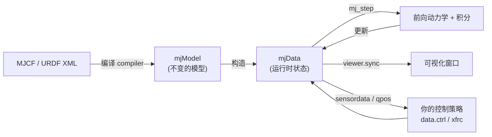

# MuJoCo 快速上手（粗读版）

> 目标：先建立整体印象 —— **它是怎么跑的、文件怎么看、怎么仿真、怎么操控**。
> 细节不用背，知道去哪儿查就行。参考官方文档：<https://docs.mujoco.cn/en/stable/overview.html> 和 <https://mujoco.readthedocs.io/en/stable/python.html>
>
> 本仓库：模型都在 `models/`，脚本都在 `scripts/`，本文档里的路径都相对**仓库根目录**。

---

## ⚡ 先跑起来（5 分钟）

别急着读概念，先把例子跑起来看一眼「活的」仿真：

```bash
cd /home/egg/Projects/mujoco_test
python scripts/simulate.py          # 一个盒子自由落体（会弹出窗口）
```

窗口操作：左键拖拽=转视角，右键=平移，滚轮=缩放，`ESC` 退出。

看到盒子掉下来，你就完成了 MuJoCo 的第一次仿真。**然后带着这个问题往下读：
上面这几行代码，每一行在干嘛？**

> 看不懂概念时最好的办法：**先跳着读，把命令都跑一遍**，回头再看解释会顺很多。

### 术语速查（说人话）

| 术语 | 说人话 |
|------|--------|
| 模型 / `mjModel` | 机器人的「说明书」：有哪些零件、多重、怎么连。**不变** |
| 数据 / `mjData` | 机器人「此刻的状态」：在哪、多快、受什么力。**每一步都变** |
| `mj_step` | 「时间前进一小步」。反复调用 = 播放动画 |
| 关节 joint | 能转 / 能滑的「铰链」。没有关节的零件就是焊死的 |
| geom | 有形状的零件（盒子 / 球 / 圆柱…），负责碰撞和外观 |
| 执行器 actuator | 电机。你给它「命令」，它产生力 |
| `ctrl` | 你给电机的命令。是**力矩**还是**目标角度**，取决于电机类型 |
| 浮基 freejoint | 让整个机器人能自由飘（而不是钉死在地上）|
| 步态 gait | 腿的摆动规律，比如「对角两条腿一起迈」 |

---

## 0. 一句话理解 MuJoCo

MuJoCo = **Mu**lti-**Jo**int dynamics with **Co**ntact，一个做机器人 / 生物力学 / 强化学习用的**刚体物理引擎**。

它的设计哲学是「数据导向」而不是面向对象：没有一堆对象，只有**两个大结构体 + 一大堆函数**：

| 结构 | 作用 | 特点 |
|------|------|------|
| `mjModel` | 描述模型（不变） | 由 XML 编译而来，质量、几何、关节、执行器参数都在这 |
| `mjData` | 保存运行时状态（每步都变） | 位置、速度、控制、传感器、接触力… |

一个核心函数走天下：

```python
mujoco.mj_step(model, data)   # 推进一步物理仿真（前向动力学 + 积分）
```

其它低频但重要的函数：

- `mj_forward(model, data)`：只做前向计算，**不推进时间**（不加积分），用于「设置好状态后先算一遍」
- `mj_resetData(model, data)`：把状态重置回初始（`qpos = qpos0`）
- `mj_name2id(model, mjtObj.mjOBJ_BODY, "名字")`：名字 → 整数 id

**记忆点**：模型是「说明书」，数据是「当前快照」，`mj_step` 是「翻页」。

---

## 1. 文件怎么看：MJCF (XML)

MJCF 是 MuJoCo 自己的建模语言，本质就是一棵 XML 树。看文件只要认几个块：

```xml
<mujoco>
  <compiler/>      <!-- 编译选项：角度单位、坐标系等 -->
  <option/>        <!-- 物理选项：重力、时间步、积分器等 -->
  <default/>        <!-- 默认值（类似 CSS，省得每个元素都写） -->
  <asset/>          <!-- 资源：网格 mesh、贴图 texture、材质 material -->
  <worldbody>       <!-- 世界 + 所有物体（运动学树） -->
    <body>          <!-- 刚体 -->
      <joint/>      <!-- 关节：定义这个 body 相对父级的自由度 -->
      <geom/>       <!-- 几何形状：视觉 + 碰撞 -->
      <site/>       <!-- 标记点：不碰撞，用于传感器/肌腱等 -->
      <camera/> <light/>
      <body>...</body>  <!-- 嵌套 → 层级结构 -->
    </body>
  </worldbody>
  <tendon/>         <!-- 肌腱（绳子/约束） -->
  <actuator/>        <!-- 执行器（电机/位置控制等） -->
  <sensor/>         <!-- 传感器 -->
  <equality/> <contact/> <keyframe/> ...
</mujoco>
```

### 关键概念：body / joint / geom 的分工

- **body**：只提供坐标系、质量、惯性，**本身没有形状**
- **joint**：给 body 增加自由度。没有 joint 的 body = 焊死在父级上
  - `free`：6 自由度（自由飘浮，常用于物体）
  - `ball`：球关节（3 自由度，四元数表示）
  - `hinge`：铰链（1 自由度旋转，绕 `axis`）
  - `slide`：滑轨（1 自由度平移）
- **geom**：真正「有形状」的东西，负责碰撞和渲染（plane / sphere / capsule / box / cylinder / ellipsoid / mesh）
- **site**：无质量的「虚拟点/坐标框」，不参与碰撞

### 用你工作区的例子对照

**`models/hello.xml`** —— 最小的「会掉下来的盒子」：

```xml
<worldbody>
  <light diffuse=".5 .5 .5" pos="0 0 3" dir="0 0 -1"/>
  <geom type="plane" size="1 1 0.1" rgba=".9 0 0 1"/>   <!-- 地面 -->
  <body pos="0 0 1">
    <joint type="free"/>                                 <!-- 6 自由度 → 会下落 -->
    <geom type="box" size=".1 .2 .3" rgba="0 .9 0 1"/>   <!-- 盒子 -->
  </body>
</worldbody>
```

**`models/arm.xml`** —— 7 自由度机械臂 + 用肌腱吊着的圆柱：

```xml
<default>
  <geom rgba=".8 .6 .4 1"/>   <!-- 统一默认颜色 -->
</default>

<worldbody>
  <body pos="0 0 1">
    <joint type="ball"/>                                     <!-- 肩：球关节 -->
    <geom type="capsule" size="0.06" fromto="0 0 0  0 0 -.4"/> <!-- 大臂 -->
    <body pos="0 0 -0.4">
      <joint axis="0 1 0"/> <joint axis="1 0 0"/>             <!-- 肘：两个铰链 -->
      <geom type="capsule" size="0.04" fromto="0 0 0  .3 0 0"/> <!-- 小臂 -->
      <body pos=".3 0 0">
        <joint axis="0 1 0"/> <joint axis="0 0 1"/>           <!-- 腕：两个铰链 -->
        <geom pos=".1 0 0" size="0.1 0.08 0.02" type="ellipsoid"/>
        <site name="end1" pos="0.2 0 0" size="0.01"/>         <!-- 端点标记 -->
      </body>
    </body>
  </body>

  <body pos="0.3 0 0.1">
    <joint type="free"/>
    <geom size="0.07 0.1" type="cylinder"/>
    <site name="end2" pos="0 0 0.1" size="0.01"/>
  </body>
</worldbody>

<tendon>
  <spatial limited="true" range="0 0.6" width="0.005">        <!-- 绳子一样，限长 0.6 -->
    <site site="end1"/>
    <site site="end2"/>
  </spatial>
</tendon>
```

> 注意：`arm.xml` 里**没有执行器**，所以它现在只是「被动」地上演一段物理动画。

---

## 2. 怎么仿真：Python 标准四步

MuJoCo 的 Python 绑定就叫 `mujoco`，安装：`pip install mujoco`。

**固定套路**（和你的 `simulate.py` 完全一致）：

```python
import mujoco
import mujoco.viewer
import time

model = mujoco.MjModel.from_xml_path('models/hello.xml')  # 1. 加载模型
data  = mujoco.MjData(model)                       # 2. 创建数据

with mujoco.viewer.launch_passive(model, data) as viewer:  # 3. 开可视化窗口
    while viewer.is_running():
        mujoco.mj_step(model, data)   # 4. 推进仿真一步
        viewer.sync()                 #    把状态同步到画面
        time.sleep(0.01)              #    粗略按真实时间播放
```

### 三种 Viewer 模式（记住区别就好）

| 模式 | 调用 | 用途 |
|------|------|------|
| **Passive** | `viewer.launch_passive(m, d)` | 不阻塞，**你自己写循环**、自己控时机（最常用，你在用这个） |
| Managed | `viewer.launch(m, d)` | 阻塞，viewer 自己驱动物理循环 |
| Standalone | `python -m mujoco.viewer --mjcf=xxx.xml` | 命令行直接开窗看模型 |

> 已有窗口还能直接拖拽模型文件进去加载。
> 想让时间准确可以使用官方推荐的写法：
> ```python
> time_until_next = model.opt.timestep - (time.time() - step_start)
> if time_until_next > 0: time.sleep(time_until_next)
> ```

### 无渲染跑「纯物理」（比如批量采样）

```python
import mujoco
model = mujoco.MjModel.from_xml_path('hello.xml')
data  = mujoco.MjData(model)

while data.time < 10:          # 一直跑到仿真时间 10 秒
    mujoco.mj_step(model, data)

print(data.qpos)               # 打印最终关节状态
```

小技巧：`mj_step(model, data, nstep=20)` 一次推进 20 步，比循环快（少一次次 GIL 切换）。

### 怎么读状态（`data` 里都有啥）

```python
data.time          # 仿真时间
data.qpos          # 关节位置（广义坐标）
data.qvel          # 关节速度
data.ctrl          # 控制输入（执行器）
data.sensordata    # 传感器读数

# 按名字取（推荐，不用记下标）：O(1) 且可读性好
data.body('end1').xpos        # 某个 body / site 的世界坐标
data.joint('hinge').qpos
model.nu, model.nq, model.nv  # 执行器数 / 位置维度 / 速度维度

# 注意：返回的是内存视图，会随仿真变化！要留存请 .copy()
traj.append(data.body('end1').xpos.copy())
```

---

## 3. 怎么操控：加执行器 + 写 `data.ctrl`

「操控」= 给系统施加**控制信号**。这需要在 XML 里加 `<actuator>`，然后每步写 `data.ctrl`。

### 例：给一个铰链关节加电机

```xml
<mujoco>
  <worldbody>
    <body pos="0 0 1">
      <joint name="hinge" type="hinge" axis="0 0 1"/>
      <geom type="capsule" fromto="0 0 0 0.3 0 0" size="0.02"/>
    </body>
  </worldbody>

  <actuator>
    <motor name="m1" joint="hinge" gear="1"/>     <!-- 力矩控制 -->
  </actuator>

  <sensor>
    <jointpos joint="hinge"/>                      <!-- 读取关节角度 -->
  </sensor>
</mujoco>
```

```python
import mujoco, numpy as np

model = mujoco.MjModel.from_xml_path('arm_ctrl.xml')
data  = mujoco.MjData(model)

while data.time < 5:
    data.ctrl[0] = 0.5            # 给 1 号执行器恒定力矩（或换成你的控制策略）
    mujoco.mj_step(model, data)
    print(data.qpos, data.sensordata)
```

### 常见执行器类型

| XML 写法 | 含义 | `ctrl` 是什么 |
|----------|------|----------------|
| `<motor joint="j"/>` | 力矩源 | 目标力矩 |
| `<position joint="j" kp="10"/>` | 位置伺服（PD） | 目标角度/位置 |
| `<velocity joint="j" kv="5"/>` | 速度伺服 | 目标速度 |
| `<general>` | 通用（自定义传动、增益） | 看配置 |

- `model.nu` = 执行器个数，也就是 `data.ctrl` 的长度
- 多个关节要多个 actuator，按顺序对应 `data.ctrl[0], data.ctrl[1] ...`
- 也可以用 `data.ctrl[model.actuator('m1').id]` 这种「按名字」写法更稳

### 想直接施加外力？

```python
data.xfrc_applied[body_id] = [fx, fy, fz, tx, ty, tz]   # 施加在 body 上的外力/力矩
```

---

## 4. 完整心智模型（一张图）



一句话循环：**写 `ctrl` → `mj_step` → 读 `qpos` / `sensordata` → 再写 `ctrl`…**

---

## 5. 官方文档地图（该查哪页）

| 想了解 | 看哪个页面 |
|--------|-----------|
| 整体理念、模型元素、常见困惑 | [Overview](https://docs.mujoco.cn/en/stable/overview.html) |
| XML 每个标签/属性怎么写 | [XML Reference](https://docs.mujoco.cn/en/stable/XMLreference.html) |
| 建模思路、调参、坑 | [Modeling](https://docs.mujoco.cn/en/stable/modeling.html) |
| 物理算法原理（接触、积分器） | [Computation](https://docs.mujoco.cn/en/stable/computation/index.html) |
| Python 用法、Viewer、命名访问 | [Python](https://docs.mujoco.cn/en/stable/python.html) |
| 函数/结构体逐个查 | [API Reference](https://docs.mujoco.cn/en/stable/APIreference/index.html) |
| 官方模型库（可直接抄） | [Model Gallery](https://docs.mujoco.cn/en/stable/models.html) |

> 想要现成模型练手，去 GitHub 仓库 `google-deepmind/mujoco` 的 `model/` 目录，比如 `humanoid/humanoid.xml`、`car/car.xml`。

---

## 6. 常见坑（提前知道就不踩）

1. **`data` 的数组是内存视图**，不 `.copy()` 的话记录历史全是同一个值。
2. **角度**：MJCF 里默认用**度**，但 `mjModel`/`mjData` 里全是**弧度**。
3. **单位不强制**：MuJoCo 只要求「一致的单位制」，默认重力 `-9.81`、密度 `1000`（贴近 MKS）。
4. **碰撞过滤**：默认**父子 body 之间不碰撞**；但父级是**静态 body（世界或固定的）**时，这个过滤不生效（所以地面挡得住东西，也容易产生「意外的碰撞」）。
5. **仿真爆炸/发散**：多半是 `timestep` 太大，调小 `model.opt.timestep` 或换更稳的积分器。
6. **MuJoCo 用关节坐标**：不能随便把某个 body 直接摆到任意位置（除了 `free` 关节）；要那样做需要逆运动学。

---

## 7. 下一步练手建议

1. 跑通 `scripts/simulate.py` 和 `scripts/simulate_arm.py`（窗口里拖拽鼠标能扰动模型，很好玩）。
2. 复制 `models/hello.xml` 一份 → 把重力改成 0、给盒子加个 `<motor>`，看它飞出去。
3. 给 `models/arm.xml` 的肩/肘关节加 `<position>` 执行器，写个正弦信号 `ctrl[i] = 0.5*sin(t)`，看手臂摆动。
4. 用 `<sensor>` 加一个 `jointpos`，把角度打到终端 / 画图。
5. 从 Model Gallery 下载 `humanoid.xml`，直接跑起来看看。

---

## 8. 进阶方向：机器人仿真（四足）

如果你的目标是机器人仿真（比如让四足机器人跑起来），看 **[`02-四足机器人仿真路线.md`](02-四足机器人仿真路线.md)**：
里面有浮基、力矩/位置执行器、步态、RL 的完整路线图，以及两个**已跑通**的示例
（`models/quadruped.xml` 自造极简四足、`models/unitree_go2/` 真机模型）。
Go2 模型怎么来的、改没改过，见 **[`03-Go2使用与改动说明.md`](03-Go2使用与改动说明.md)**。
