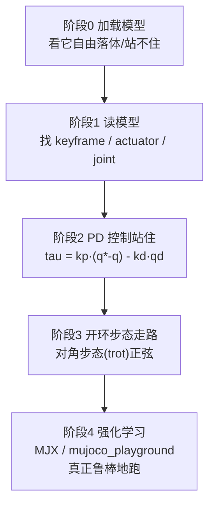

# 四足机器人 MuJoCo 仿真路线图

> 目标：从「会 `mj_step`」走到「四足机器人跑起来」。
> 本文配套两个**已经跑通**的例子：`quadruped.xml`（自造极简四足）和 `unitree_go2/`（真机模型）。
>
> 环境：conda `mujoco_env`（mujoco 3.14.0）。运行命令统一用
> `/home/egg/miniconda3/envs/mujoco_env/bin/python`

---

## 0. 一句话结论：四足 = 浮基 + 12 个关节 + 接触

| 关键点 | 说明 |
|--------|------|
| **浮基 (floating base)** | 躯干用一个 `<freejoint/>` 接到世界，拥有 6 个自由度（3 平移 + 3 旋转）。**没有它机器人就是钉在地上的** |
| **腿的关节** | 每条腿 3 个（hip 外展 / thigh 大腿 / calf 小腿），4 条腿 = 12 个关节 → `nu = 12` |
| **接触** | 4 个脚和地面接触，靠摩擦产生前进推力。这是四足「走/跑」的物理来源 |
| **执行器** | 两种流派：**力矩电机**（Go2，`ctrl` = 力矩）或**位置伺服**（`ctrl` = 目标角度） |

数据维度记住这个：Go2 是 `nq=19`（7 浮基 + 12 关节）、`nv=18`（6 + 12）、`nu=12`。

---

## 1. 路线图：五个阶段



- **阶段 0–2**：理解 MuJoCo 与四足的基本控制回路。**本仓库已给你跑通**。
- **阶段 3**：手写步态能走，但**开环、脆**（不能上坡、不能被推、换参数容易翻）。
- **阶段 4**：想真正「跑起来」（agile、抗扰动、过地形），业界标准答案是 **强化学习**。

---

## 2. 读真实模型：以 Go2 为例

真实模型不用自己写，官方 Menagerie 已经调好。看一个四足模型，重点只看四处：

```xml
<compiler angle="radian" meshdir="assets" autolimits="true"/>   <!-- 1. 弧度制 + 网格目录 -->
<option cone="elliptic" impratio="100"/>                        <!-- 2. 接触锥 + 摩擦比 -->

<default>
  <joint damping="2" armature="0.01" frictionloss="0.2"/>       <!-- 3. 关节阻尼/惯量补偿 -->
  <motor ctrlrange="-23.7 23.7"/>                               <!--    ctrl = 力矩(N·m) -->
  <default class="knee"><motor ctrlrange="-45.43 45.43"/></default>
</default>

<body name="base" pos="0 0 0.445">
  <freejoint/>                                                  <!-- 4. 浮基！四足的灵魂 -->
  ...
</body>

<actuator>                                                      <!-- 12 个力矩电机 -->
  <motor name="FL_hip"   joint="FL_hip_joint"/>
  <motor name="FL_thigh" joint="FL_thigh_joint"/>
  <motor name="FL_calf"  joint="FL_calf_joint"/>
  ... 共 12 个
</actuator>

<keyframe>
  <!-- home = 一个能站住的姿态。qpos: [7维浮基] + [12关节]，ctrl 为对应的保持力矩 -->
  <key name="home" qpos="0 0 0.27 1 0 0 0  0 0.9 -1.8  0 0.9 -1.8  0 0.9 -1.8  0 0.9 -1.8"
        ctrl="0 0.9 -1.8 0 0.9 -1.8 0 0.9 -1.8 0 0.9 -1.8"/>
</keyframe>
```

**怎么用 keyframe 一键摆好姿态：**

```python
mujoco.mj_resetDataKeyframe(model, data, model.key("home").id)   # 摆到 home 姿态
q_home = data.qpos[7:].copy()                                    # 12 个关节角，作为 PD 基准
```

### 执行器两种流派（很重要）

| | `<motor>` 力矩 | `<position>` 位置伺服 |
|---|---|---|
| `ctrl` 含义 | 目标**力矩** N·m | 目标**角度** rad |
| 典型模型 | Unitree Go2 / A1 / ANYmal | 教学模型、简单手臂 |
| 控制难度 | 要自己写 PD / RL | 给了角度就能动，简单 |
| 谁在用 | 真机、RL 研究 | 教学、快速原型 |

---

## 3. 可跑示例 A：自造极简四足（先看结构）

`quadruped.xml` 只有 ~100 行，没有网格文件，**最适合理解 MJCF 结构**：
躯干 + 4 条腿 × (thigh, knee) 两个关节 = 8 个**位置执行器**。

```bash
# 开窗口看（需要图形界面）
python scripts/run_quadruped.py
# 无窗口验证
python scripts/run_quadruped.py --headless

# 实测结果：8 秒前进 +5.1 m，全程站立
```

步态核心就三行（`run_quadruped.py`）：

```python
theta = omega*t + 2*np.pi*phase
data.ctrl[thigh_id] = amp_thigh * np.sin(theta)     # 大腿前后摆
data.ctrl[knee_id]  = -amp_knee * np.sin(theta)     # 与大腿反相：支撑伸、摆动收
```

对角步态 (trot)：`FL+RR` 一组同相，`FR+RL` 另一组反相 —— 这是四足最经典的步态。

> 注意：这组参数（freq=2.4, thigh=0.45, knee=0.38 rad）是**扫描出来的**。改参数它就会翻，
> 因为开环步态对模型很敏感。这正好说明了为什么后面要上 RL。

---

## 4. 可跑示例 B：真机 Go2（力矩控制）

模型从 Menagerie 复制到本工作区 `models/unitree_go2/`（**源文件未改动**）。
Go2 是**力矩电机**，所以流程是「自己算 PD → 写 ctrl」：

```python
q  = data.qpos[7:]           # 12 关节角
qd = data.qvel[6:]           # 12 关节速度（浮基速度占前 6 维）
target = q_home + 步态参考    # 目标关节角
data.ctrl[:] = kp * (target - q) - kd * qd      # PD → 力矩
mujoco.mj_step(model, data)
```

```bash
python scripts/run_go2.py --mode hold                # 站住（PD 保持 home 姿态）
python scripts/run_go2.py --mode trot                # 对角步态行走
python scripts/run_go2.py --mode trot --headless     # 无窗口 + 打印结果

# 实测：
#   hold  → 高度 0.264 m（home 0.27），站住
#   trot  → 5 秒前进 +2.43 m，全程站立
```

关键参数（`--mode trot` 默认值，已扫描调优）：
`--freq 2.4 --amp-thigh 0.55 --amp-calf 0.60`（单位 **弧度**）。

---

## 5. 让它真正「跑起来」：两条路

### 路线一：手写步态（我们上面做的）
- ✅ 优点：不用训练，秒级出结果，**理解原理的最佳方式**
- ❌ 缺点：**开环**。不能上坡、不能被推、换机身质量/摩擦就翻。
- 适合：验证模型、做基线、理解步态相位

### 路线二：强化学习（业界主流）
真正让四足在复杂地形跑起来，标准做法是 RL：

| 工具 | 说明 |
|------|------|
| **MuJoCo Playground** | Google DeepMind 官方，**自带 Go2 等四足的运动环境**，PPO 训练开箱即用，最推荐入门 |
| **MJX** | MuJoCo 的 JAX 版，GPU 上并行几千个环境，训得快 |
| **stable-baselines3 + Gymnasium** | 经典 PPO/SAC 库，`Gymnasium` 里的 `Ant-v4`（四足）可当练手 |
| **dm_control** | DeepMind 的老牌库，含四足 locomotion 任务 |

**RL 的标准接口（四足）**：
- **观测 obs**：躯干姿态(四元数)、角速度、线速度、12 个关节角、12 个关节速度、上一帧动作、（可选）地形/指令
- **动作 act**：12 维，通常是**目标关节角**，再经 PD 转成力矩（≈ `kp=20~40, kd=0.5~1`）
- **奖励 reward**：前进速度 + 保持直立 − 能耗 − 动作变化率
- 用 **PPO** 训，几千到上万个并行环境

> 实战建议：先用 `mj_inverse` / 仿真建一个「站住」的 PD 基线（阶段 2 已完成），
> 再把它作为 RL 的动作解码器，这样训练会稳很多。

---

## 6. 本地 Menagerie 使用说明

你的模型库（源文件，别改）：
```
/home/egg/Desktop/mujoco_source/mujoco_menagerie_main/
```

**可用的四足模型：**

| 目录 | 机器人 | 关节数 |
|------|--------|--------|
| `unitree_go2` | Unitree Go2 | 12 |
| `unitree_go1` | Unitree Go1 | 12 |
| `unitree_a1` | Unitree A1 | 12 |
| `anybotics_anymal_b` / `_c` | ANYbotics ANYmal | 12 |
| `boston_dynamics_spot` | Boston Dynamics Spot | 19 |
| `google_barkour_v0` / `_vb` | Google Barkour | 12 |

**标准操作：复制到工作区再改（保护源文件）**

```bash
cp -r /home/egg/Desktop/mujoco_source/mujoco_menagerie_main/unitree_a1  ./models/unitree_a1
python -m mujoco.viewer --mjcf models/unitree_a1/scene.xml     # 直接开窗看
```

每个模型目录的约定：
- `assets/` — 网格（.obj/.stl）
- `<model>.xml` — 纯机器人本体（无地面/灯光）
- `scene.xml` — 本体 + 地面 + 灯光（**加载这个**）
- `<model>_mjx.xml` — MJX(GPU 并行) 版本

---

## 7. 常用 API 速查（四足场景）

```python
# 加载与初始化
model = mujoco.MjModel.from_xml_path('unitree_go2/scene.xml')
data  = mujoco.MjData(model)
mujoco.mj_resetDataKeyframe(model, data, model.key("home").id)

# 步进（nstep 可一次多步，减少 GIL 开销）
mujoco.mj_step(model, data)

# 状态
data.qpos[0:3]      # 躯干位置 xyz
data.qpos[3:7]      # 躯干姿态四元数 (w,x,y,z)
data.qpos[7:]       # 12 个关节角
data.qvel[0:6]      # 躯干线速度+角速度
data.qvel[6:]       # 12 个关节速度
data.ctrl[:]        # 控制输入（nu 维）

# 按名字取（O(1)，推荐）
model.actuator('FL_thigh').id
data.body('base').xpos          # 注意：内存视图，要留存请 .copy()

# 传感器（XML 里定义 <sensor> 后）
data.sensordata
```

---

## 8. 下一步练习（由易到难）

1. `python scripts/run_go2.py --mode trot` 开窗口看它走，用 `--freq / --amp-thigh / --amp-calf` 感受参数影响。
2. 把 `scripts/run_go2.py` 的 `--mode hold` 里的 `kp` 从 40 调到 200，观察「静差 → 抖动」的权衡。
3. 把 `scripts/run_go2.py` 的步态换成 **pace（同侧）** 或 **bound（前后）**，看哪种能走。
4. 复制 `unitree_a1` 到 `models/` 下，重跑 `python scripts/run_go2.py --xml models/unitree_a1/scene.xml`（注意 A1 的 home 关键帧和关节名可能不同，学会适配）。
5. 在场景里加一个斜坡/台阶（改 `scene.xml`），看手写开环步态什么时候失败 —— 这就是你要上 RL 的理由。
6. 入门 RL：装 `mujoco_playground`，跑它的 Go2 行走环境，观察 obs/act 定义。

---

## 9. 文档地图

| 想查 | 链接 |
|------|------|
| 四足相关概念/常见坑 | [Overview](https://mujoco.readthedocs.io/en/stable/overview.html) |
| XML 标签逐个查（actuator/keyframe/sensor…） | [XML Reference](https://mujoco.readthedocs.io/en/stable/XMLreference.html) |
| 控制回路/状态与输入/浮基 | [Simulation](https://mujoco.readthedocs.io/en/stable/programming/simulation.html) |
| Python/Viewer/命名访问 | [Python](https://mujoco.readthedocs.io/en/stable/python.html) |
| 现成高质量模型 | [Menagerie](https://github.com/google-deepmind/mujoco_menagerie) |
| RL 四足（官方） | [MuJoCo Playground](https://github.com/google-deepmind/mujoco_playground) |
| GPU 并行仿真 | [MJX](https://mujoco.readthedocs.io/en/stable/mjx.html) |
