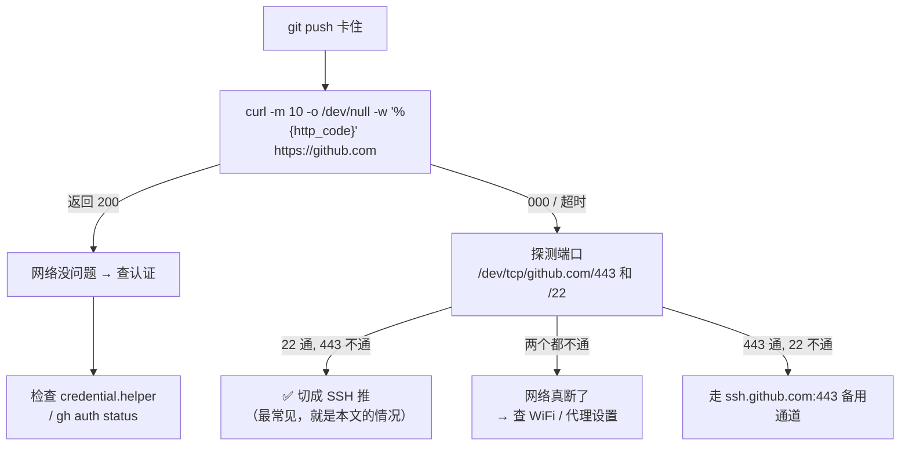

# Git 推送卡住？看这篇

> 一句话总结：**`git push` 静默卡死不报错，八成是网络问题，不是 Git 的问题。**
> 用三条命令定位 → 换条路走（HTTPS ↔ SSH）→ 5 分钟解决。
>
> 本文同时说明了 `http.sslverify=false` 这个常见"偏方"**为什么没用、以及为什么危险**。

---

## 1. 先看结论（懒人版）

### 症状速查表

| 你看到的症状 | 最可能的原因 | 立刻试这个 |
|---|---|---|
| `git push` 卡住不动、无任何输出 | HTTPS(443) 被网络阻断 | 改成 SSH 推送（见 §5） |
| 报 `SSL certificate problem` | 证书链不完整 / 内网代理 | 加 CA 证书，**不是**关校验（见 §4） |
| 卡住后弹出窗口 / 等输入 | 凭据管理器在等你输密码 | 见 §5 的"万能第一招" |

### 排查决策树

> 这是本文的核心流程图。用字符画写成，**不依赖 Mermaid 渲染**——
> 终端里、GitHub 上、纯文本编辑器里都能正常看。
> §5 还有一张等价的图形版（Mermaid），二选一看一张即可。

```text
git push 卡住（无输出、无报错）
│
├─ 【第一步】先让它报错，别干等：
│   GIT_TERMINAL_PROMPT=0 \
│   GIT_SSH_COMMAND='ssh -o BatchMode=yes -o ConnectTimeout=8' \
│   git push
│   └─ 报错信息基本就能定位问题
│
└─ 【第二步】测网络（是否连得上 github.com）
    curl -m 10 -o /dev/null -w '%{http_code}\n' https://github.com
    │
    ├─ 返回 200 ───────────────→ 网络没问题，是【认证】在卡
    │   │
    │   ├─ git config --get-all credential.helper
    │   │   └─ 配了 gui/manager → 弹窗在等你输密码
    │   └─ gh auth status
    │       └─ 没登录 / token 过期 → 重新登录
    │
    └─ 000 / 超时 ────────────→ 网络问题，继续测端口
        timeout 6 bash -c 'cat </dev/null >/dev/tcp/github.com/443' && echo 443 OK || echo 443 FAIL
        timeout 6 bash -c 'cat </dev/null >/dev/tcp/github.com/22'  && echo 22 OK  || echo 22 FAIL
        │
        ├─ 22 通, 443 不通 ───→ ✅ 最常见！切成 SSH 推（本文的情况）
        │   │
        │   └─ git remote set-url origin git@github.com:<用户名>/<仓库>.git
        │      git push
        │
        ├─ 443 通, 22 不通 ───→ 走 GitHub 的 443 SSH 备用通道
        │   │
        │   └─ ~/.ssh/config 里加：
        │        Host github.com
        │          HostName ssh.github.com
        │          Port 443
        │      然后验证：ssh -T git@github.com
        │
        └─ 两个都不通 ────────→ 网络真断了（不是 Git 的问题）
            │
            └─ 查 WiFi / 路由器 / 代理设置
               提示：curl https://www.baidu.com 若是 200，
                     说明只是 github 被阻断 → 优先走上面的 SSH
```

**万能第一招**——让"卡住"变成立刻报错，一步暴露真凶：

```bash
GIT_TERMINAL_PROMPT=0 GIT_SSH_COMMAND='ssh -o BatchMode=yes -o ConnectTimeout=8' git push
```

> 网络不通 → 立刻超时报错；认证要输入 → 立刻报错。
> **任何静默挂起都能被它逼出错误信息**，别再干等。

---

## 2. 起因：这次到底发生了什么

| 时间 | 事件 |
|------|------|
| 2026-10-05 | `git push` 卡死，无任何输出，最后 `Ctrl-C` 中断（退出码 **130**，`130 = 128 + SIGINT`，就是"被我手动掐掉"） |
| 排查 | 本地领先远端 1 个提交（`428e26d..20377a8`），网络探测发现 **github.com:443 连不上** |
| 解决 | 远端从 HTTPS 切换为 **SSH**，推送成功 |
| 后续 | 复测发现 443 **又通了** → 说明是**间歇性阻断**，不是彻底封死 |

### 排查过程记录（可复现）

```bash
# ① 能不能上网？——百度/gitee 正常，说明网是通的
curl -sS -m 8 -o /dev/null -w '%{http_code}\n' https://www.baidu.com     # 200

# ② DNS 正常吗？——正常，说明不是域名解析问题
getent hosts github.com                    # 20.205.243.166  github.com

# ③ 关键：分别探测 443 和 22 端口
timeout 8 bash -c 'cat </dev/null >/dev/tcp/github.com/443' && echo "443 OK" || echo "443 FAIL"
timeout 8 bash -c 'cat </dev/null >/dev/tcp/github.com/22'  && echo "22 OK"  || echo "22 FAIL"
# 当次结果 → 443 FAIL / 22 OK   ← 这就是根因
```

| 探测项 | 结果 | 说明 |
|---|---|---|
| DNS 解析 | ✅ 正常 | 不是域名问题 |
| 百度 / gitee | ✅ 200 | 网络本身通畅 |
| `github.com:443`（HTTPS） | ❌ **FAIL** | **根因：TCP 连不上，连接都没建立** |
| `github.com:22`（SSH） | ✅ OK | SSH 这条路是通的 |
| **443 复测（半小时后）** | ✅ 5/5 OK | 说明**间歇性**阻断，会自己恢复 |

> 💡 **教训**：GitHub 的连通性问题经常是间歇性的。
> 现在不通 ≠ 永远不通，**换一条路走**比"等它好"更靠谱。

---

## 3. `http.sslverify=false` 到底改了什么？

网上遇到 `git push` 卡住或报错，常见的"偏方"是：

```bash
git config --global http.sslverify false      # ⚠️ 不要这么做
```

**这个偏方对本次问题完全无效**，原因如下。

### 一次 HTTPS 连接分两段


- `sslverify` **只管 ③**
- 本次卡死发生在 **①**——TCP 根本没连上（`curl` 显示 `connect=0.000000s`，端口探测 FAIL）

→ **握手都没开始，证书校验开关开或关，结果一模一样，纯粹白关。**

### 取值对照

| 取值 | 行为 |
|---|---|
| `true`（**Git 默认值**） | 校验不过就**拒绝连接**，报 `SSL certificate problem: unable to get local issuer certificate` |
| `false` | **跳过校验，无条件相信**对方给的任何证书 |

---

## 4. 为什么关掉它是危险的

关了校验之后，链路上**任何能劫持你流量的人**，都可以拿一张自签名的假 `github.com` 证书，Git 会毫不犹豫接受：

- 🕵️ 中间人能看到你推送的**全部代码**
- 🔑 如果用 **token** 认证，token 会**直接落到对方手里**
- 🌐 更糟：它写在 `~/.gitconfig`（**全局**），影响你**所有仓库、所有 HTTPS 操作**，不只是 GitHub

### 那什么时候才真需要处理证书问题？

只有这两种场景，且**正确做法是"加 CA"，不是"关校验"**：

```bash
# 公司/学校内网有 TLS 中间人代理，或自建 Git 服务器用自签证书
git config --global http.sslCAInfo /path/to/公司根证书.crt
```

> ✅ 本机证书链其实是**健康的**——`openssl` 验证返回 `Verify return code: 0 (ok)`，
> 系统 CA 库完全正常。所以这条配置**零收益、纯风险**，已删除。

### 本次清理记录

```bash
git config --global --get    http.sslverify   # false   ← 删除前
git config --global --unset  http.sslverify   # 删除
git config --global --get    http.sslverify   # (无输出) ← 删除后

# 验证：走 HTTPS + 默认开启校验，正常拉取 → 删掉不影响使用
git ls-remote https://github.com/chenbinzhiegg/mujoco_test.git
```

`~/.gitconfig` 当前内容：

```ini
[http]
        postBuffer = 1048576000      # 无害，保留
[user]
        email = chenzhibin2099@hotmail.com
        name = ZhibinChen
```

---

## 5. 下次再遇到，按这个流程走

### 决策树（图形版）

> 📌 同一张图，**纯文本版在 [§1](#排查决策树)**，看一张就够了。
> 如果下面的图在你这里显示为 `graph TD ...` 这样的源码文字，说明预览器不支持 Mermaid，
> 直接看 §1 的字符画版本。



### ① 网络问题 → 切成 SSH（最快，优先试）

```bash
cd /home/egg/Projects/mujoco_test

# 改远端地址
git remote set-url origin git@github.com:chenbinzhiegg/mujoco_test.git

# 推
git push
```

**想切回 HTTPS** 随时可以：

```bash
git remote set-url origin https://github.com/chenbinzhiegg/mujoco_test.git
```

> 本仓库当前 `origin` 保持 **SSH**。SSH 密钥 `~/.ssh/id_ed25519` 已配置并认证通过
> （`ssh -T git@github.com` → `Hi chenbinzhiegg!`）。
> 注意 `ssh -T` 返回**退出码 1 是正常的**，GitHub 不提供 shell 访问。

### ② 如果 22 端口也被封 → 走 443 SSH 备用通道

在 `~/.ssh/config` 里加（文件不存在就新建）：

```
Host github.com
  HostName ssh.github.com
  Port 443
```

先验证，看到 `Hi <用户名>!` 就成了：

```bash
ssh -T git@github.com
```

> 本机实测 `ssh.github.com:443` **可用**，是 22 被封时的可靠后路。

### ③ 判断是不是"认证在等你输入"

凭据管理器弹窗/等待输入，表现也是"卡住"。查一下：

```bash
git config --get-all credential.helper      # 本机：未配置
gh auth status                              # 如果装了 gh
ls -l ~/.git-credentials                    # 本机：无此文件
```

### ④ 顺手加个"低速保护"（可选）

避免大文件传输时无限挂着：

```bash
git config --global http.lowSpeedLimit 1000
git config --global http.lowSpeedTime 30    # 速度低于 1KB/s 持续 30s 就放弃
```

---

## 6. 本机环境备忘

| 项目 | 值 |
|------|-----|
| 远端（当前） | `git@github.com:chenbinzhiegg/mujoco_test.git`（**SSH**） |
| 远端（备用） | `https://github.com/chenbinzhiegg/mujoco_test.git`（HTTPS） |
| SSH 密钥 | `~/.ssh/id_ed25519`，认证用户 `chenbinzhiegg` |
| 可用通道 | `22`（SSH）、`ssh.github.com:443`、`443`（HTTPS，**间歇性**可用） |
| 证书链 | ✅ 正常（`Verify return code: 0 (ok)`） |
| 全局 `sslverify` | 未设置（已删除，恢复 Git 默认的 `true`） |

---

## 7. 一句话记住

> **`sslverify` 管的是"证书可不可信"，不是"连不连得上"。**
> 连不上 → 换通道（HTTPS ↔ SSH）。
> 证书不可信 → 加 CA，**永远不要关校验**。

---

## 参考

- GitHub 文档 ·[关于远程仓库](https://docs.github.com/cn/get-started/getting-started-with-git/about-remote-repositories)
- GitHub 文档 ·[通过 SSH 连接](https://docs.github.com/cn/authentication/connecting-to-github-with-ssh)
- GitHub 文档 ·[在 HTTPS 端口上使用 SSH](https://docs.github.com/cn/authentication/troubleshooting-ssh/using-ssh-over-the-https-port)
- Git 文档 ·[`http.sslVerify`](https://git-scm.com/docs/git-config#Documentation/git-config.txt-httpsslVerify)
